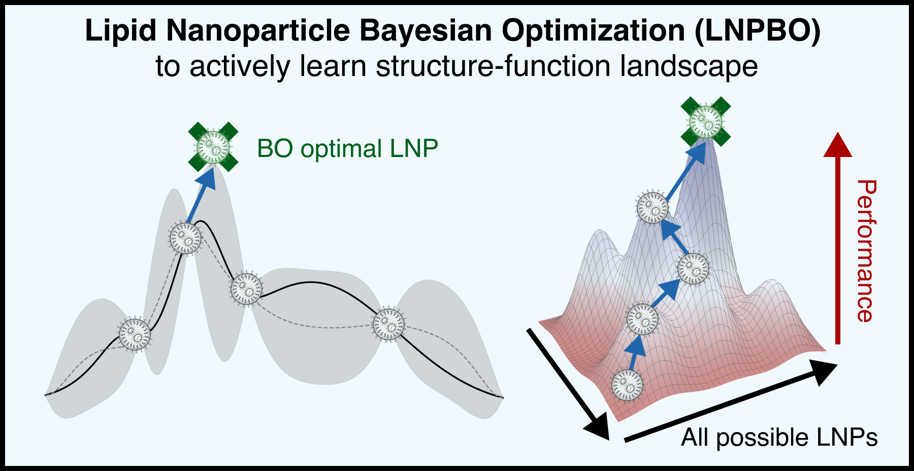

# LNPBO: Bayesian Optimization for Lipid Nanoparticle Design

<p align="center">
  
</p>

[](LICENSE)
[](https://www.python.org/downloads/)

Data-driven optimization of lipid nanoparticle (LNP) formulations using Bayesian optimization (BO) with tree-ensemble and Gaussian process surrogates. Benchmarked across **38 strategies on 26 published LNP studies** from [LNPDB](https://www.nature.com/articles/s41467-026-68818-1), the best strategies recover 1.34--1.42x more top formulations than random screening.

---

## Table of Contents

- [Installation](#installation)
- [Quickstart](#quickstart)
- [Examples](#examples)
- [Choosing a Strategy](#choosing-a-strategy)
- [Molecular Encodings](#molecular-encodings)
- [Citation](#citation)
- [License](#license)

---

## Installation

```bash
git clone https://github.com/evancollins1/LNPBO.git
cd LNPBO
pip install .
```

For GP support (BoTorch/GPyTorch):

```bash
pip install ".[gp]"
```

Optional extras:

```bash
pip install ".[bench]"     # NGBoost, TabPFN
pip install ".[mordred]"   # Mordred descriptors
pip install ".[all]"       # All optional dependencies
```

### LNPDB Setup

Benchmarks and LNPDB study examples require the [LNPDB](https://github.com/evancollins1/LNPDB) database. Clone it as a sibling directory and create the expected symlink:

```bash
git clone https://github.com/evancollins1/LNPDB.git   # sibling to LNPBO/
cd LNPBO
ln -s ../LNPDB data/LNPDB_repo
```

### Development Installation

```bash
git clone https://github.com/evancollins1/LNPBO.git
git clone https://github.com/evancollins1/LNPDB.git
cd LNPBO
ln -s ../LNPDB data/LNPDB_repo
uv venv && source .venv/bin/activate
pip install -e ".[dev]"
```

Requires Python >= 3.10.

---

## Quickstart

Given a CSV of tested LNP formulations (see [input format](#input-format)), suggest the next batch to synthesize:

```python
from LNPBO.data.dataset import Dataset
from LNPBO.space.formulation import FormulationSpace
from LNPBO.optimization.optimizer import Optimizer

# Load and encode
dataset = Dataset.from_lnpdb_csv("my_lnps.csv")
encoded = dataset.encode_dataset(feature_type="lantern")
space = FormulationSpace.from_dataset(encoded)

# Optimize
optimizer = Optimizer(space=space, surrogate_type="gp", candidate_pool=encoded.df, acquisition_type="UCB", kappa=5.0, batch_size=12)
suggestions = optimizer.suggest(output_csv="round1.csv")
```

The output CSV appends the suggested formulations (with blank `Experiment_value`) to your original data. Test them in lab, fill in results, and re-run for the next round.

---

## Examples

The `examples/` folder contains Jupyter notebooks for four use cases.

LNPBO supports two BO modes:

- **Discrete pool BO (retrospective or prospective)** — A surrogate model scores a fixed candidate pool and selects the most promising batch. Best for library screening where lipid identities vary. *(Examples 2, 3, 4)*
- **Continuous BO (prospective, real-time)** — A GP optimizes over continuous ratio bounds to suggest new formulations not in any existing pool. Best for ratio-only optimization with fixed lipid identities. *(Examples 1, 4)*

Examples 1–3 use synthetic data to illustrate the input format. **Example 4 uses real LNPDB data** and demonstrates both modes on published studies.

<details>
<summary><b>Example 1: Ratio optimization (continuous BO, real-time)</b> &mdash; fixed lipid identities, varying molar ratios</summary>

A scientist has chosen lipid identities (cKK-E12, DOPE, Cholesterol, DMG-PEG2000) and wants to optimize IL, HL, and CHL molar ratios plus the IL:mRNA mass ratio.

```python
from LNPBO.data.dataset import Dataset
from LNPBO.space.formulation import FormulationSpace
from LNPBO.optimization.optimizer import Optimizer

dataset = Dataset.from_lnpdb_csv("examples/example1/example1.csv")
encoded = dataset.encode_dataset(encoding_csv_path="example1_enc.csv")
space = FormulationSpace.from_dataset(encoded)

optimizer = Optimizer(space=space, surrogate_type="gp", gp_engine="sklearn", acquisition_type="UCB", kappa=5.0, batch_size=24)
suggestions = optimizer.suggest(output_csv="example1_round1.csv")
```

Since no lipid identities vary, SMILES columns are optional and no molecular encoding is needed. The sklearn GP engine is used here for fast, continuous optimization over ratio bounds.

See: [`examples/example1/example1.ipynb`](examples/example1/example1.ipynb)

</details>

<details>
<summary><b>Example 2: Ratio + helper lipid optimization (discrete pool BO, retrospective or prospective)</b> &mdash; varying HL identity and molar ratios</summary>

A scientist fixes the IL identity but wants to explore alternative helper lipids while optimizing ratios. This requires molecular encoding to featurize HL structure.

```python
dataset = Dataset.from_lnpdb_csv("examples/example2/example2.csv")
encoded = dataset.encode_dataset(feature_type="lantern", encoding_csv_path="example2_enc.csv")
space = FormulationSpace.from_dataset(encoded)

optimizer = Optimizer(space=space, surrogate_type="gp", candidate_pool=encoded.df, acquisition_type="UCB", kappa=5.0, batch_size=24)
suggestions = optimizer.suggest(output_csv="example2_round1.csv")
```

**Multi-round optimization:** When round 1 results come back from the lab, reload and re-run:

```python
dataset = Dataset.from_lnpdb_csv("example2_round1_w_results.csv")
encoded = dataset.encode_dataset(feature_type="lantern", encoding_csv_path="example2_enc_r2.csv")
space = FormulationSpace.from_dataset(encoded)
optimizer = Optimizer(space=space, surrogate_type="gp", candidate_pool=encoded.df, acquisition_type="UCB", kappa=5.0, batch_size=24)
suggestions = optimizer.suggest(output_csv="example2_round2.csv")
```

See: [`examples/example2/example2.ipynb`](examples/example2/example2.ipynb)

</details>

<details>
<summary><b>Example 3: Full library screening (discrete pool BO, retrospective or prospective &mdash; tree surrogate)</b> &mdash; varying IL, HL identities and molar ratios</summary>

A scientist wants to screen a combinatorial library of ionizable lipids and helper lipids while co-optimizing molar ratios. This is the most complex scenario.

```python
dataset = Dataset.from_lnpdb_csv("examples/example3/example3.csv")
encoded = dataset.encode_dataset(feature_type="lantern", encoding_csv_path="example3_enc.csv")
space = FormulationSpace.from_dataset(encoded)

optimizer = Optimizer(space=space, surrogate_type="ngboost", candidate_pool=encoded.df, batch_size=24)
suggestions = optimizer.suggest(output_csv="example3_round1.csv")
```

Alternative encodings:

```python
# Morgan fingerprints (fast, 2048-bit)
encoded = dataset.encode_dataset(feature_type="mfp")

# Mordred descriptors (requires: pip install ".[mordred]")
encoded = dataset.encode_dataset(feature_type="mordred")
```

See: [`examples/example3/example3.ipynb`](examples/example3/example3.ipynb)

</details>

<details>
<summary><b>Example 4: Real LNPDB studies (both use cases)</b> &mdash; retrospective discrete pool BO + prospective ratio optimization on published data</summary>

Demonstrates both BO modes on real LNPDB data:
- **Discrete pool BO** on PMID 39060305 (HeLa, 1,200 IL-diverse formulations) — simulates multi-round screening with XGBoost-UCB, RF-TS, and NGBoost surrogates
- **Continuous ratio BO** on PMID 35879315 (HepG2, 1,080 ratio-only formulations) — optimizes molar ratios with a GP surrogate

```python
from LNPBO.data.lnpdb_bridge import load_lnpdb_full
from LNPBO.optimization.optimizer import Optimizer

dataset = load_lnpdb_full()
df = dataset.df
study = df[(df["Publication_PMID"] == 39060305) & (df["Model_type"] == "HeLa")].copy()
# ... encode, split, run BO loop (see notebook for full example)
```

See: [`examples/example4_lnpdb/example4_lnpdb.ipynb`](examples/example4_lnpdb/example4_lnpdb.ipynb)

</details>

### LNPDB studies for benchmarking

| Study | Cell type | Formulations | Scenario |
|-------|-----------|-------------|----------|
| AA_2008 (PMID 18438401) | HeLa | 497 | IL library screening |
| KW_2014 (PMID 24969323) | HeLa | 1,182 | IL library screening |
| JW_2024 (PMID 37985700) | A549 | 1,801 | IL library screening |
| YZ_2022 (PMID 35879315) | HepG2 | 1,080 | Ratio optimization |
| YX_2024 (PMID 39060305) | HeLa | 1,200 | IL + ratio optimization |
| LM_2019 (PMID 31570898) | HeLa | 1,080 | IL library screening |

### Input format

Each row is one LNP formulation. Required columns:

| Column | Description |
|--------|-------------|
| `IL_name` | Ionizable lipid name |
| `IL_SMILES` | Ionizable lipid SMILES (optional if IL identity is fixed) |
| `IL_molratio` | IL molar ratio |
| `IL_to_nucleicacid_massratio` | IL:nucleic acid mass ratio |
| `HL_name`, `HL_SMILES`, `HL_molratio` | Helper lipid |
| `CHL_name`, `CHL_SMILES`, `CHL_molratio` | Cholesterol |
| `PEG_name`, `PEG_SMILES`, `PEG_molratio` | PEG lipid |
| `Experiment_value` | Functional readout (e.g., transfection) |

---

## Choosing a Strategy

Based on our benchmark of 38 strategies across 26 LNP studies:

| Scenario | Recommended strategy |
|----------|---------------------|
| Default / general use | `NGBoost-UCB` or `RF-TS` |
| Screening diverse IL libraries | Tree-based surrogates (RF, XGBoost, NGBoost) |
| Ratio-only optimization | `CASMOPolitan` or GP-based methods |
| Limited compute budget | `XGBoost-Greedy` (no uncertainty quantification needed) |

```python
# NGBoost with UCB (best overall in benchmarks)
optimizer = Optimizer(space=space, surrogate_type="ngboost", candidate_pool=encoded.df, batch_size=24)

# Random Forest with Thompson Sampling
optimizer = Optimizer(space=space, surrogate_type="rf_ts", candidate_pool=encoded.df, batch_size=24)

# CASMOPolitan (mixed continuous/categorical)
optimizer = Optimizer(space=space, surrogate_type="casmopolitan", candidate_pool=encoded.df, batch_size=24)
```

**Acquisition functions:** `"UCB"` (upper confidence bound), `"EI"` (expected improvement), `"LogEI"` (log expected improvement). `kappa` (UCB) and `xi` (EI/LogEI) control exploration vs. exploitation.

**Batch strategies:** `"kb"` (Kriging Believer), `"rkb"` (Resampling KB), `"lp"` (Local Penalization), `"ts"` (Thompson sampling), `"qlogei"` (q-Log Noisy EI), `"gibbon"` (GIBBON).

---

## Molecular Encodings

| Encoding | Description | Best for |
|----------|-------------|----------|
| `lantern` | Count Morgan FP + RDKit descriptors, PCA to 5 PCs | Default, best overall |
| `mfp` | Morgan fingerprints (2048-bit) | Fast baseline |
| `count_mfp` | Count-based Morgan fingerprints | When counts matter |
| `rdkit` | RDKit 2D descriptors | Physicochemical properties |
| `mordred` | Mordred 2D descriptors (`pip install ".[mordred]"`) | Rich physicochemical features |
| `unimol` | Uni-Mol 3D molecular embeddings | 3D structure-aware |
| `chemeleon` | CheMeleon embeddings | Pretrained chemical language model |
| `lion` | LiON lipid-specific embeddings | Lipid-tailored representations |
| `agile` | AGILE foundation model embeddings | Pretrained embeddings available |

---

## Citation

**Benchmarking Optimization Strategies for Lipid Nanoparticle Design: 38 Strategy Configurations Across 26 Studies**

Evan Collins\*, Anmol Seth\*, Robert Langer, Daniel G. Anderson

*Under review*

```bibtex
@article{collins2026lnpbo,
  title   = {Benchmarking Optimization Strategies for Lipid Nanoparticle Design: 38 Strategy Configurations Across 26 Studies},
  author  = {Collins, Evan and Seth, Anmol and Langer, Robert and Anderson, Daniel G.},
  year    = {2026},
  note    = {Under review}
}
```

---

## License

MIT License. See [LICENSE](LICENSE) for details.
